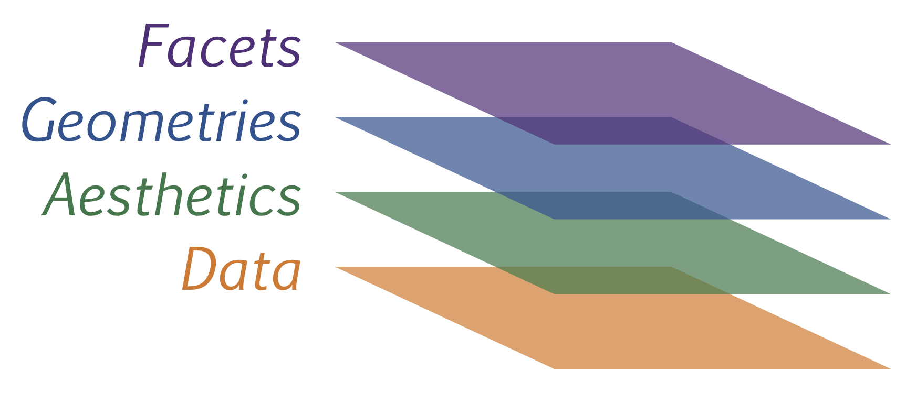
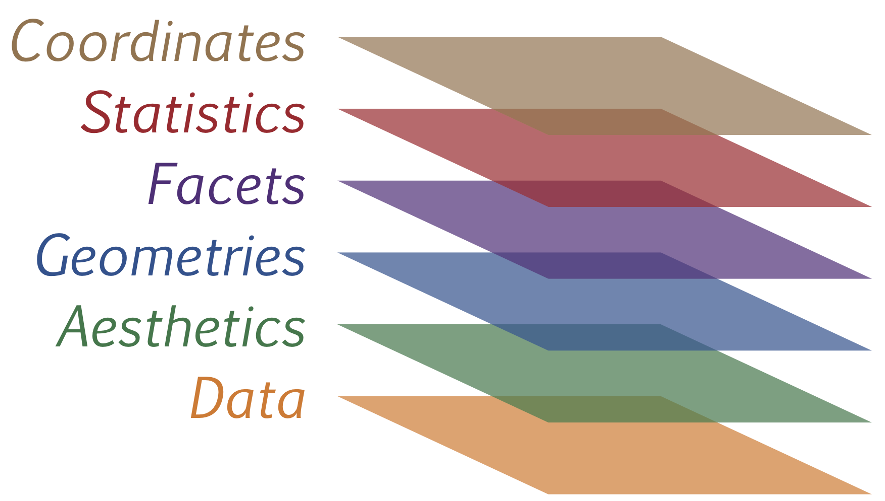

# Let's get started with ggplot2
## An example: GDP and Life Expectancy

```{r}
library(ggplot2)
library(gapminder)  # 'gapminder' package contains the data
gapminder           # Let's take a look at the data
```

## Another look at the data frame

```{r}
str(gapminder)      # str() is a good way to look at the data frame
```

## Simple Scatterplot

```{r}
ggplot(gapminder, aes(x = gdpPercap, y = lifeExp)) # nothing to plot yet!
```

## Simple Scatterplot

We can make the graph into an object to alter and add stuff later:
```{r, }
p <- ggplot(data = gapminder, aes(x = gdpPercap, y = lifeExp)) 
```

* we create an object p, containing the pieces of information that we are interested in plotting with ggplot
* x = gdpPercap and y = lifeExp define what will go in the x and y axes
* they are "aesthetic mappings" connecting pieces of data with the visibles in the plot

* Begin a plot with ggplot().
* It creates the coordinate axis that you add to.
* The first argument is the dataset
* Next you want to add layers to the plot.
* In our example: geom_point() adds a layer of points. 
* Lots of different geom functions doing different things.
* geom functions take mapping arguments.
* Defines how variables in your dataset are mapped to visual properties.
* Always paired with aes().
* The x and y arguments specify which variables to map to the axes.


## Simple Scatterplot

```{r, }
p + geom_point()   # Now we tell ggplot that we want a satter plot
```

## Simple Scatterplot

```{r, }
ggplot( data = gapminder, aes(x = gdpPercap, y = lifeExp)) +
        geom_point()   
  # Of course, we can write that in one swoop
```

## Log Transformation

```{r}
ggplot(gapminder, aes(x = log10(gdpPercap), y = lifeExp)) +
  geom_point() +
  scale_x_log10()
```

## Let's keep that scale setting

```{r}
p <- p + scale_x_log10()
```

## **Map** continent variable to aesthetic color
```{r}
p + geom_point(aes(color = continent))
```

## To recap: full plot command thus far

```{r}
ggplot(gapminder, aes(x = gdpPercap, y = lifeExp)) +
  geom_point(aes(color = continent)) + scale_x_log10() 
```
<small> Note, we put the aes() in the geom_point() element. We will see in a bit why. </small>

## Reduce overplotting 
```{r}
p + geom_point(aes(color = continent), alpha = 0.3, size=3)  
  # Setting transparency of points
```

## Adding fitted curve
```{r}
p + geom_point(aes(color = continent)) + geom_smooth()  
  # by default, adds a loess fit
```

## Adding fitted curve
```{r}
p + geom_point(aes(color = continent)) + 
  geom_smooth(color="black", lwd=2, se=FALSE)  
   # removing the confidence intervals
```

## We could exchange the order of the layers

```{r}
p + geom_smooth(color="black", lwd=2, se=FALSE) + 
  geom_point(aes(color = continent)) 
```

## Use a linear fit instead
lm, glm, gam, loess, rlm
```{r}
p + geom_point(aes(color = continent)) + geom_smooth(method="lm")  
```

## Smooth fit by continent

```{r}
p + geom_point(aes(color = continent)) +
  geom_smooth(lwd = 2, se = FALSE, aes(color = continent))
```

## Now all layers use the continent grouping

```{r}
# We could add the aes() grouping to the overall graph p
p <- p + aes(color = continent)
p + geom_point() +
  geom_smooth(lwd = 2, se = FALSE)
```


## Why another color=continent?

```{r, eval=FALSE}
# Our original plot command:
ggplot(gapminder, aes(x = gdpPercap, y = lifeExp)) +
  geom_point() + scale_x_log10() 

# A single smoothed line through all points:
ggplot(gapminder, aes(x = gdpPercap, y = lifeExp)) +
  geom_point() + scale_x_log10() + geom_smooth()

# Using the color aesthetic for the smoothing as well as the scatter points
ggplot(gapminder, aes(x = gdpPercap, y = lifeExp, color = continent)) +
  geom_point() + scale_x_log10() + geom_smooth(lwd=2, se=FALSE)

# Still single black smoothed line but now points are colored by continent:
ggplot(gapminder, aes(x = gdpPercap, y = lifeExp, color = continent)) +
  geom_point(aes(color = continent)) + scale_x_log10() +
  geom_smooth(color="black")
```

# Grammar of Graphics
## The Grammar of Graphics

- ggplot is based on a "grammar" of graphics, an idea originated with Wilkinson (2005)

{width=30%}

## Main principles

* there are few main principles:
    + Graphics = distinct layers of grammatical elements (or grammar rules) that map pieces of data to geometric objects (like lines and points) and attributes (like color and size)
    + if necessary some additional rules about scales, projections in a coordinate system, and data transformations are possible
    + Plots arise through aesthetic mapping
* The grammar produces “sentences” (mappings of data to objects) but they can easily be garbled if you define poor mappings.

## Three key grammatical elements

| Element | Description | 
|------:|:-----:|
| **Data** | The dataset being plotted. |
| **Aes**thetics | The scales onto which we map our data. |
| **Geom**etries | The visual elements used for our data. | 

- every ggplot2 plot has these three key components

## All seven grammatical elements

| Element | Description | 
|------:|:-----:|
| **Data** | The dataset being plotted. |
| **Aes**thetics | The scales onto which we map our data. |
| **Geom**etries | The visual elements used for our data. | 
| **Facet**s | Plotting subsets of the data. | 
| **Stat**istics | Statistical representations of our data to aid understanding. | 
| **Coord**inates | The space on which the data will be plotted. | 
| **Theme**s | All non-data ink. | 

## A diagram of the graphical elements

{width=100%}

## ggplot2 layers: data 
<br><br><br><br><br><br><br><br>
{width=50%}


## ggplot2 layers: data 

```{r}
gapminder
```

## ggplot2 layers: aesthetics 

<br><br><br><br><br><br><br>
{width=50%}

## ggplot2 layers: aesthetics 

```{r, eval=FALSE}
ggplot(gapminder, aes(x = gdpPercap, y = lifeExp))
```
<br>


| country | continent | year | lifeExp | pop | gdpPercap |
|:-------|:---------|:----|:-------|:---|:---------|
|        |           |      |    y    |     |     x |

## ggplot2 layers: geometries

<br><br><br><br><br><br>
{width=50%}

## ggplot2 layers: geometries

```{r}
ggplot(gapminder, aes(x = gdpPercap, y = lifeExp, color = continent)) +
        geom_point(alpha=0.5, size=3)
```

## ggplot2 layers: facets

<br><br><br><br><br>
{width=50%}

## ggplot2 layers: facets
```{r}
ggplot(gapminder, aes(x = gdpPercap, y = lifeExp, color = continent)) +
        geom_point(alpha=0.5, size=3) + 
        facet_grid( . ~ continent)
```

## ggplot2 layers: statistics

<br><br><br><br>
{width=50%}


## ggplot2 layers: statistics
```{r}
ggplot(gapminder, aes(x = gdpPercap, y = lifeExp, color = continent)) +
        geom_point(alpha=0.5, size=3) + 
        facet_grid( . ~ continent) + 
        geom_smooth(color="black", lwd=1, se=TRUE)  
```

## ggplot2 layers: coordinates

<br><br><br>
{width=50%}

## ggplot2 layers: coordinates
```{r}
ggplot(gapminder, aes(x = gdpPercap, y = lifeExp, color = continent)) +
        geom_point(alpha=0.5, size=3) + 
        facet_grid( . ~ continent) + 
        geom_smooth(color="black", lwd=1, se=TRUE) + 
        scale_x_log10("GDP per Capita") +
        scale_y_continuous("Life Expectancy in Years")
```

## ggplot2 layers: theme

<br><br>
{width=50%}

## ggplot2 layers: theme
theme_tufte(), theme_classic(), theme_minimal()
```{r}
library(ggthemes)
ggplot(gapminder, aes(x = gdpPercap, y = lifeExp, color = continent)) +
        geom_point(alpha=0.5, size=3) + 
        facet_grid( . ~ continent) + 
        geom_smooth(color="black", lwd=1, se=TRUE) + 
        scale_x_log10("GDP per Capita") +
        ylab("Life Expectancy in Years") + 
        theme_tufte() + theme(legend.position="none")
```

## ggplot2 layers: theme
```{r, eval=FALSE}
library(ggthemes)
ggplot(gapminder, aes(x = gdpPercap, y = lifeExp, color = continent)) +
        geom_point(alpha=0.5, size=3) + 
        facet_grid( . ~ continent) + 
        geom_smooth(color="black", lwd=1, se=TRUE) + 
        scale_x_log10("GDP per Capita", 
                      labels = scales::trans_format("log10", 
                      scales::math_format(10^.x))) + 
        ylab("Life Expectancy in Years") + 
        theme_economist() + 
        theme(legend.position="none") + 
        ggtitle("The relationship between wealth and longevity")
```

## ggplot2 layers: theme
```{r, echo=FALSE}
library(ggthemes)
ggplot(gapminder, aes(x = gdpPercap, y = lifeExp, color = continent)) +
        geom_point(alpha=0.5, size=3) + 
        facet_grid( . ~ continent) + 
        geom_smooth(color="black", lwd=1, se=FALSE) + 
        scale_x_log10("GDP per Capita", 
                      labels = scales::trans_format("log10", 
                      scales::math_format(10^.x))) + 
        ylab("Life Expectancy in Years") + 
        theme_economist() + 
        theme(legend.position="none") + 
        ggtitle("The relationship between wealth and longevity")
```


# The Plot-Making Process in ggplot

## Understanding the layers of ggplot2

Recall: the three key grammatical elements:

| Element | Description | 
|------:|:-----:|
| **Data** | The dataset being plotted. |
| **Aes**thetics | The scales onto which we map our data. |
| **Geom**etries | The visual elements used for our data. | 

Let's take a closer look at these now.

## Recall: Aesthetic vs. Attributes 

- an attribute is simply a setting of things like color, shape, size etc. independent of what the data looks like
- in contrast, in the aesthetics layer, we **map** features of the data onto visible aesthetics

## Recall: Setting Attributes

Here we set three attributes of the points: alpha, size, color
```{r}
library(ggplot2)
library(gapminder)
ggplot(gapminder, aes(x = gdpPercap, y = lifeExp)) + 
        scale_x_log10() +
        geom_point(alpha=0.5, size=3, color="red")
```


## Mapping onto shape

```{r}
ggplot(gapminder, aes(x = gdpPercap, y = lifeExp, shape=continent)) + 
        geom_point(size=3, alpha=0.3) + scale_x_log10()
```

## Mapping onto size

```{r}
ggplot(gapminder, aes(x = gdpPercap, y = lifeExp, size=pop)) + 
        scale_x_log10() +
        geom_point(alpha=0.3)
```

## Recall: Combining mappings
```{r,echo=FALSE}
library(magrittr)
library(dplyr)
gm_subset <- gapminder %>%
  filter(country %in% c("China","United States","Russia"))  
```

```{r, fig.width=6, fig.height=4}
ggplot(subset(gapminder, continent %in% c("Americas","Europe")), 
       aes(x = gdpPercap, y = lifeExp, size=year, 
           color=continent, shape=continent)) + 
       scale_x_log10() + geom_point(alpha=0.3)
```

## Typical aesthetics

| Aesthetic | Description | 
|------:|:-----:|
| x | X axis position |
| y | Y axis position |
| colour | Colour of dots, outlines of other shapes |
| fill | Fill colour |
| size | Diameter of points, thickness of lines |
| alpha | Transparency |
| linetype | Line dash pattern |
| labels | Text on a plot or axes |
| shape | Shape |

## Aesthetics and Geoms

- each `geom()` layer allows you to set the aesthetics that make sense for the particular plot `geom()`
- for example, `geom_point` understands the following aesthetics: x, y, alpha, color, fill, group, shape, size, stroke. For `geom_point()` the aesthetics x and y are required.
- some aesthetics are limited to continous variables, others to categorical variables

## Aesthetics - Continuous Variables

| Aesthetic | Description | 
|------:|:-----:|
| x | X axis position |
| y | Y axis position |
| colour | Colour of dots, outlines of other shapes |
| fill | Fill colour |
| size | Diameter of points, thickness of lines |
| alpha | Transparency |
| ~~linetype~~ | Line dash pattern |
| ~~labels~~ | Text on a plot or axes |
| ~~shape~~ | Shape |

## Aesthetics - Continuous Variables

```{r}
ggplot(filter(gapminder,year==2007), 
  aes(x = gdpPercap, y = lifeExp, size=pop)) +
  scale_x_log10() + geom_point(alpha=0.3) + 
  scale_size_continuous(name="pop", range = c(1,20))
```

## Aesthetics - Continuous Variables

```{r, fig.width=6, fig.height=4}
d <- filter(gapminder, year %in% c(1967,1977,1987,1997,2007))
ggplot(d, aes(x = gdpPercap, y = lifeExp, color=pop)) + 
  scale_x_log10() + geom_point(alpha=0.3, size=3)
```

## Aesthetics - Continuous Variables

- size works clearly better than color in this case
- there are general guides about which types of aesthetics work better for which kind of variables -- these are rooted in our understanding of **visual perception** as we have seen earlier.

## Aesthetics - Categorical Variables - Mapping onto shape

```{r, fig.width=6, fig.height=4}
ggplot(d, aes(x = gdpPercap, y = lifeExp, shape=continent)) +
  scale_x_log10() + geom_point(alpha=0.3, size=4)
```

## Adding redundant channel to emphasize

```{r, fig.width=6, fig.height=4}
ggplot(d, aes(x = gdpPercap, y = lifeExp, shape=continent)) +
  scale_x_log10() + geom_point(alpha=0.3, size=4) +
  geom_point(data=filter(d, continent=="Americas"), 
   color="red", alpha=0.5, size=4) + theme(legend.position="none")
```

## Encircle to emphasize 
```{r, echo=FALSE}
previousplot <- ggplot(d, aes(x = gdpPercap, y = lifeExp, shape=continent)) +
  scale_x_log10() + geom_point(alpha=0.3, size=2) +
  geom_point(data=filter(d, continent=="Americas"), 
   color="red", alpha=0.5, size=2) + theme(legend.position="none")
```


```{r, fig.width=6, fig.height=4}
# ggalt() includes the encircle() function
# devtools::install_github("hrbrmstr/ggalt", force=FALSE)
library(ggalt)
previousplot + geom_encircle(data=filter(d, country=="United States"), 
                expand=0.05, color="blue", linetype=2, size=2)

```

## Connect to emphasize 

```{r, echo=TRUE, fig.width=12, fig.height=8, eval=FALSE}
library(ggthemes)
ggplot(d, aes(x = gdpPercap, y = lifeExp, shape=continent)) +
  scale_x_log10() + 
  geom_path(data=filter(d, country=="United States"), 
            color="light blue", linetype=1, size=6) +
  geom_path(data=filter(d, country=="Venezuela"), 
            color="light green", linetype=1, size=6) +
  geom_path(data=filter(d, country=="Haiti"), 
            color="orange", linetype=1, size=6) +
  geom_point(alpha=0.3, size=4) +
  geom_point(data=filter(d, continent=="Americas"), 
              color="red", alpha=0.5, size=4) + 
  theme(legend.position="none") +
  annotate("text", x = c(40000), y = c(73), size=6, 
           color="dark blue", label = c("United States")) +
  annotate("text", x = c(13000), y = c(63), size=6, 
           color="dark green", label = c("Venezuela")) +
  annotate("text", x = c(1200), y = c(62), size=6, 
           color="dark orange", label = c("Haiti")) + theme_tufte()
```

## Connect to emphasize 

```{r, echo=FALSE, fig.width=12, fig.height=8}
library(ggthemes)
ggplot(d, aes(x = gdpPercap, y = lifeExp, shape=continent)) +
  scale_x_log10() + 
  geom_path(data=filter(d, country=="United States"), 
            color="light blue", linetype=1, size=6) +
  geom_path(data=filter(d, country=="Venezuela"), 
            color="light green", linetype=1, size=6) +
  geom_path(data=filter(d, country=="Haiti"), 
            color="orange", linetype=1, size=6) +
  geom_point(alpha=0.3, size=4) +
  geom_point(data=filter(d, continent=="Americas"), 
   color="red", alpha=0.5, size=4) + theme(legend.position="none") +
  annotate("text", x = c(40000), y = c(73), family="serif", size=6, color="dark blue",
           label = c("United States")) +
  annotate("text", x = c(13000), y = c(63), family="serif", size=6, color="dark green",
           label = c("Venezuela")) +
  annotate("text", x = c(1200), y = c(62), family="serif", size=6, color="dark orange",
           label = c("Haiti")) + theme_tufte()
```

## Box plots and Dot Plots

- For some plots we have a specific `geom()`. E.g. box plots are created with `geom_boxplot`.
- For other plots we can use the geoms we already know. E.g. for dot plots we can use `geom_point()`
- overall 37 geoms, but good to know a few. Use the [ggplot2 cheat sheet](https://www.rstudio.com/wp-content/uploads/2016/11/ggplot2-cheatsheet-2.1.pdf).

## Examples: Geoms and Type of Plot

Name of Plot  | Geom | Other Features |
--------------|-------|--------------
scatterplot   | point |  |
bubblechart   | point | size mapped to a variable |
barchart      | bar   | |
box-and-whisker plot | boxplot |
line chart    | line | |

## A New Dataset - Organ Donors

<!--- 
organs.url <- "https://raw.githubusercontent.com/socviz/soc880/gh-pages/data/organ-procurement.csv"
organs.data <- read.csv(url(organs.url), row.names=1)
-->
```{r, get-organdata, echo= TRUE}
organs <- read.csv("organ_donors.csv")

dim(organs)
head(organs)

## For convenience, let R know year is a time measure.
organs$year <- as.Date(strptime(organs$year, format="%Y"))

```

## Let's take a quick look

- Let explore the data a bit with some plots.

```{r}

p <- ggplot(data=organs,
            aes(x=year,
                y=donors))

p + geom_point()

```

## Some lineplots again

```{r}


p + geom_line(aes(group=country,
                  color=consent.law)) +
    scale_color_manual(values=c("gray40", "firebrick")) +
    scale_x_date() + 
    labs(x="Year",
         y="Donors",
         color="Consent Law") +
    theme(legend.position="top")
```

## Faceting 

- We can also split the plot by some factor, called *faceting*

```{r}
# ggplot has two faceting functions that do slightly different things: `facet_grid()`, seen here, and `facet_wrap()`. Try them out on the Gapminder data.

p + geom_line(aes(group=country)) +
    labs(x="Year",
         y="Donors") +
    facet_grid(.~consent.law)
```


## A quick bit of data manipulation - Average by group

```{r}

library(dplyr)
by.country <- organs %>% group_by(consent.law, country) %>%
    summarize(donors=mean(donors, na.rm = TRUE))
by.country

```

## Ordered dotplots

```{r}
p <- ggplot(by.country, aes(x=donors, y=country, color=consent.law))
p + geom_point(size=3)

```

- Note, we are using `geom_point()` again.
- How can we improve this graph?

## Ordering

We know that order helps visual perception.

```{r}

p <- ggplot(by.country, aes(x=donors, y=reorder(country,donors), 
                            color=consent.law))
p + geom_point(size=3)

```

- Get your factors (the categorical variable) in order when it makes sense.

## Improve the labels

```{r}
p + geom_point(size=3) +
    labs(x="Donor Procurement Rate (per million population)",
         y="", color="Consent Law") +
    theme(legend.position="top")
```

## Another way 

```{r}
p <- ggplot(by.country, aes(x=donors, y=reorder(country, donors)))
p + geom_point(size=3) +
    facet_grid(consent.law ~ ., scales="free") +
    labs(x="Donor Procurement Rate (per million population)",
         y="",
         color="Consent Law") +
    theme(legend.position="top")

```


## Boxplot

```{r}
p <- ggplot(data=organs,aes(x=country,y=donors)) 
p + geom_boxplot() +
    coord_flip() +   # This is one way to get a horizontal box plot
    labs(x="", y="Donor Procurement Rate")


```

## Boxplot

```{r}
p <- ggplot(data=organs,aes(x=reorder(country, donors, na.rm=TRUE), y=donors)) 
p + geom_boxplot() + coord_flip() +
    labs(x="", y="Donor Procurement Rate")
```

## Boxplot

```{r}
p <- ggplot(data=organs,aes(x=reorder(country, donors, na.rm=TRUE),y=donors)) 
p + geom_boxplot(aes(fill=consent.law)) +
    coord_flip() + labs(x="", y="Donor Procurement Rate")
```

## Boxplot - Add some jitter

```{r}
# Can combine jitter and boxplot if needed
ggplot(data=organs,aes(x=reorder(country, donors, na.rm=TRUE),y=donors)) + 
  geom_boxplot(aes(fill=consent.law), outlier.colour="transparent", alpha=0.3) +
  coord_flip() + labs(x="", y="Donor Procurement Rate") +
  geom_jitter(shape=21, aes(fill=consent.law), color="black",
              position=position_jitter(w=0.1))
```


## 1-D point summaries

```{r}

p <- ggplot(data=organs, aes(x=reorder(country, donors, na.rm=TRUE), y=donors)) 
p + geom_point(aes(color=consent.law)) +
    coord_flip() + labs(x="", y="Donor Procurement Rate")
```


## Add a little jitter

```{r}

p <- ggplot(data=organs,aes(x=reorder(country, donors, na.rm=TRUE), y=donors)) 
p + geom_jitter(aes(color=consent.law)) + coord_flip() + 
        labs(x="", y="Donor Procurement Rate")


```


## Fine-tune the jittering

```{r}
p <- ggplot(data=organs, aes(x=reorder(country, assault, na.rm=TRUE), y=assault)) 
p + geom_jitter(aes(color=world),
                position = position_jitter(width=0.15)) +
    coord_flip() +
    labs(x="", y="Assault") +
    theme(legend.position="top")
```

## A few more useful geoms

```{r, echo=FALSE}
df <- data.frame(
  x = c(3, 1, 5),
  y = c(2, 4, 6),
  label = c("a","b","c"))
p <- ggplot(df, aes(x, y, label = label)) +
  labs(x = NULL, y = NULL) + # Hide axis label
theme(plot.title = element_text(size = 12)) # Shrink plot title p + geom_point() + ggtitle("point")
```


```{r, eval=FALSE}
p + geom_point() + ggtitle("point")
p + geom_text() + ggtitle("text")
p + geom_bar(stat = "identity") + ggtitle("bar") 
p + geom_tile() + ggtitle("raster")
p + geom_line() + ggtitle("line")
p + geom_area() + ggtitle("area")
p + geom_path() + ggtitle("path")
p + geom_polygon() + ggtitle("polygon")
```


Familiarize yourself with these options in `ggplot2()`.

## Thank you!


